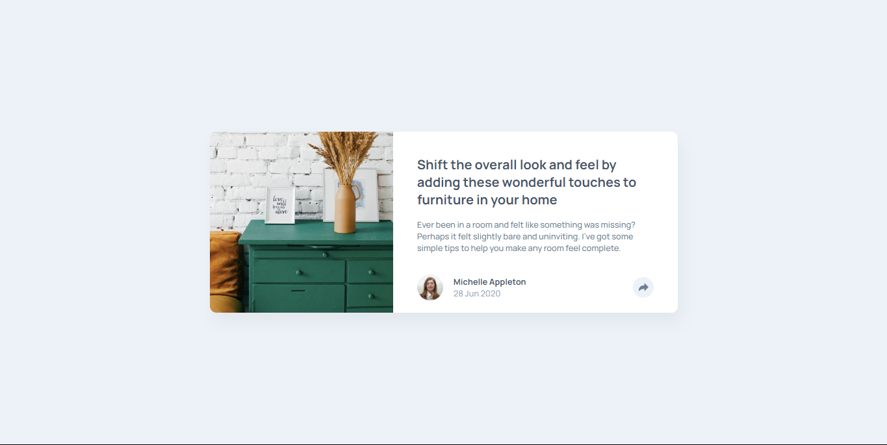
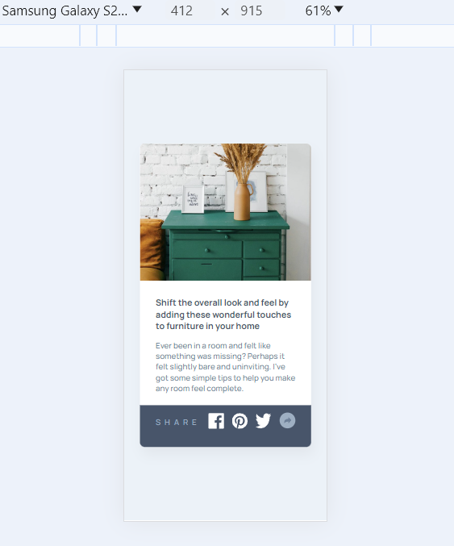

# Frontend Mentor - Article preview component solution

This is a solution to the [Article preview component challenge on Frontend Mentor](https://www.frontendmentor.io/challenges/article-preview-component-dYBN_pYFT). Frontend Mentor challenges help you improve your coding skills by building realistic projects. 

## Table of contents

- [Overview](#overview)
  - [The challenge](#the-challenge)
  - [Screenshot](#screenshot)
  - [Links](#links)
- [My process](#my-process)
  - [Built with](#built-with)
- [Author](#author)

## Overview

### The challenge

Users should be able to:

- View the optimal layout for the component depending on their device's screen size
- See the social media share links when they click the share icon

### Screenshot

Desktop

Desktop Active

Mobile

Mobile Active

### Links

- Solution URL: [Solution URL](https://github.com/Y-ashbhatt/Article-preview-component-master)
- Live Site URL: [Live site URL ](https://y-ashbhatt.github.io/Article-preview-component-master/)

## My process

### Built with

- Semantic HTML5 markup
- CSS custom properties
- Flexbox
- CSS Grid
- Mobile-first workflow

## Author

- Frontend Mentor - [@Y-ashbhatt](https://www.frontendmentor.io/profile/Y-ashbhatt)
- Twitter - [@yash_bhatt01](https://x.com/yash_bhatt01)

